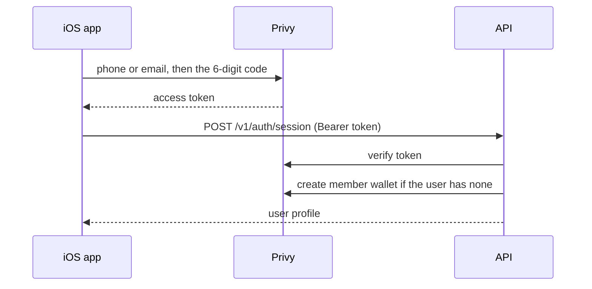

# Architecture

The backend is being rewritten. The target design is [architecture/backend-platform.md](architecture/backend-platform.md).
The full description of today's code is [legacy/architecture.md](legacy/architecture.md).

This page is what stays true through the rewrite: the parts, the outside services, the wallets, and how money moves. Read [product.md](product.md) first if you want the rules from the user's side (what a cabal is, how shares and votes work).

## In one paragraph

An iOS app talks to one Go API over HTTP. The API keeps the books in Postgres (members, share units, votes, trades) and keeps the money on Solana mainnet, in wallets that Privy holds the keys for. Every member has one Privy wallet, and every cabal has one Privy treasury wallet. When a vote passes or an agent sends a valid trade, the API swaps the treasury's USDC for a tokenized stock on Jupiter, and Privy signs for the treasury. An app-owned "relayer" wallet pays every Solana fee, so users never need SOL. There is no custom on-chain program: Solana holds the assets, and Postgres holds who owns what share of them.

Two rules hold everywhere:

1. **The phone only talks to Privy and the Monaco API.** It never calls Jupiter, Solana, a catalog, or a price feed. Everything it shows comes from the API.
2. **Only the API moves money.** Users never sign a Solana transaction. The API asks Privy to sign for member wallets and treasuries, and the relayer pays the fee.

## Repo map

| Path | What it is | Language |
| --- | --- | --- |
| `apps/backend` | The API server and ops commands. Being rewritten; see [backend-platform.md](architecture/backend-platform.md#repository-layout). | Go |
| `apps/mobile` | The iOS app (SwiftUI, iOS 18+) | Swift |
| `apps/web` | Waitlist landing page for trymonaco.xyz. Static HTML plus two serverless functions. See its [README](https://github.com/lognorman20/monaco/blob/main/apps/web/README.md). | JS |
| `packages/mobile-core` | Swift logic the app uses that can be tested on a Mac without a simulator: API client, JSON models, formatting, copy | Swift |
| `scripts` | Dev scripts behind the `just` recipes: env loading, simulator, database, QA | Bash |
| `docs` | These docs | |

Go and Swift share no code. **The HTTP API is the contract.** The rewrite generates both sides from one OpenAPI spec ([backend-platform.md](architecture/backend-platform.md#thin-client)).

## Outside services

Every third party Monaco depends on, what it does, and what happens without it.

| Service | Used for | Config | Required? |
| --- | --- | --- | --- |
| **Solana mainnet** | Where the money lives. Cash is USDC (mint `EPjFWdd5AufqSSqeM2qN1xzybapC8G4wEGGkZwyTDt1v`). Positions are tokenized stocks. | `SOLANA_RPC_URL` (public endpoint if unset; use a paid one outside local dev) | Yes |
| **Privy** | Sign-in by SMS or email code. Holds the keys for every member wallet and cabal treasury, and signs for them when the API asks. | `PRIVY_APP_ID`, `PRIVY_APP_SECRET`, `PRIVY_VERIFICATION_KEY`, `PRIVY_APP_CLIENT_ID`, `PRIVY_AUTHORIZATION_*` | Yes |
| **Relayer wallet** | Not a service: an app-owned Solana keypair that pays every transaction fee. The API refuses to start if it holds 0.001 SOL or less. | `RELAYER_PRIVATE_KEY` | Yes |
| **Postgres** | The ledger: users, cabals, share units, votes, trades, NAV history. Docker Compose locally, Supabase in a hosted setup. | `DATABASE_URL` | Yes |
| **Jupiter** | Swaps treasury USDC for stock tokens and back (Swap API v2). Also a price source and chart candles. | `JUPITER_API_KEY` (optional; higher rate limit) | Yes |
| **xStocks** | Catalog of tokenized US stocks (`AAPLx`, `TSLAx`, …): symbol to Solana mint address. Metadata only; trades still go through Jupiter. | none | Yes |
| **Tessera, PreStocks** | Catalogs of pre-IPO tokens (SpaceX, OpenAI, …). Same buy and sell path as stocks. | `TESSERA_ENABLED`, `PRESTOCKS_ENABLED` (both on by default) | No |
| **Pyth Hermes** | First choice for live stock marks when valuing a pot. Needs an equity-entitled key. | `PYTH_API_KEY` | No. Without it, marks come from Jupiter. |
| **Yahoo Finance** | Chart history for the underlying stock (the default chart source). | `CHART_SOURCE=yahoo` (default) or `jupiter` | No |
| **Definitive Flash** | Alternative swap venue. Off by default. | `SWAP_PROVIDER=flash`, `FLASH_API_KEY` | No |
| **Supabase Storage** | Stores profile photos and cabal pictures. | `SUPABASE_URL`, `SUPABASE_SERVICE_ROLE_KEY` | No. Photo upload is off without it. |
| **ClawPump** | Runs trading agents. Monaco never talks to it; ClawPump's agent calls the Monaco API. | `PUBLIC_API_BASE_URL` (the URL agents are told to call) | No |
| **Sentry** | Error reports for panics and internal errors. | `SENTRY_DSN` | No |

The full env list with comments is in `.env.example`. The rewrite adds Synadia Cloud for NATS and Grafana Cloud for traces, metrics, logs, and alerts. See [Deploy and observability](architecture/backend-platform.md#deploy-and-observability).

## Wallets

Four kinds of wallet appear in this repo. Only the first three are part of the product.

| Wallet | How many | Keys held by | Holds | Job |
| --- | --- | --- | --- | --- |
| **Member wallet** | One per user | Privy (the API can sign) | USDC | The user's deposit address. USDC sitting here is their **account balance**. |
| **Treasury** | One per cabal | Privy (app-owned) | USDC and stock tokens | The cabal's shared pot. Every trade and every cash out signs from here. |
| **Relayer** | One per environment | The API (`RELAYER_PRIVATE_KEY`) | SOL | Pays fees for every transaction, so the other wallets never need SOL. |
| Phantom agent wallet | One per developer | A coding agent's Phantom MCP | USDC, SOL | **Not product.** Used to fund test accounts with real USDC during QA. See the [README](https://github.com/lognorman20/monaco/blob/main/README.md#agent-qa-phantom-mcp). |

## Flows

Each flow below is the path one user action takes. The same rules apply whether a person or an agent starts it. The full list of flows, with their events and outcomes, is in [backend-platform.md](architecture/backend-platform.md#flows).

### Sign in

The API sees nothing until the code is accepted. A user always keeps the same member wallet; login never makes a second one.

### Deposit and fund a cabal

Money reaches a cabal in two separate steps.

1. **Deposit.** The user copies their member-wallet address from the app and sends Solana USDC to it from anywhere (an exchange, Phantom). Nothing else happens. The USDC sits in their wallet and shows as **account balance**: on-chain USDC minus money already on its way somewhere.
2. **Fund.** The user picks a cabal and an amount. The backend moves exactly that amount into the treasury and credits share units once Solana confirms.

Shares are credited only after the transfer confirms, and only once per transaction signature. Shares are priced at the pot's current value, so a new member never takes earlier members' gains ([the math](product.md#shares-and-pot-value)).

### Propose, vote, trade

- Only a member of the cabal's voter set can propose or vote.
- A buy is refused up front if Jupiter cannot route it, or if it is bigger than the whole pot.
- A proposal passes by majority or unanimously (the cabal's rule), or dies at its expiry.
- The stock tokens land in the treasury. A failed swap can be retried.
- Sells work the same way. Proposals can also add, pause, resume or remove an agent.

### Agent trade

A cabal votes an agent in with a USDC budget and gets an API key. The agent never holds money or keys to the treasury. Its trades land in the treasury next to the members' trades and show in the cabal's activity feed. Over-budget trades are refused, never partly filled. Details: [agent-trading.md](agent-trading.md). Setup: [how-to/connect-an-agent.md](how-to/connect-an-agent.md).

### Cash out and withdraw

These are also two separate steps, mirroring deposit and fund.

1. **Cash out**: the member sells some or all of their share units back to the cabal.
   1. Their share units are debited first.
   2. If the treasury is short of USDC, their slice of the holdings is sold on Jupiter.
   3. USDC equal to their slice of the pot goes from the treasury to their member wallet.
   4. If the backend stops partway, it finishes the payout or returns the shares. It never pays twice.
2. **Withdraw**: USDC moves from the account balance to any Solana address the user pastes.

Leaving a cabal can cash out the whole stake in the same step.

### Valuing a pot

Every screen, every share credit and every cash out values the pot the same way:

- **Pot value** = the treasury's USDC that the ledger can account for, plus each holding times its current mark.
- **Marks** come from a chain of sources, each tried in order: Pyth, then Jupiter's price for the token. A source that keeps failing is skipped for a while.
- Anything that moves money needs a live mark. With none, the fund waits and retries, and a cash out fails with the shares returned. Screens may fall back to the purchase price so they still render.

## Safety properties

What the design guarantees:

| Guarantee | How |
| --- | --- |
| Money is never credited or paid twice | Every transfer's signature is stored before it is broadcast, so a crash or a retry finishes the first transaction instead of sending a second one. |
| A retried request never repeats a trade | Every mutating call takes an `Idempotency-Key` header. The server stores the response and replays it. |
| A new member cannot take existing gains | Shares are priced at the current pot value. Rounding always favours the pot. |
| An agent cannot overspend | Its budget is checked and reserved before each swap. It can only sell what it bought. |
| Non-members see nothing | Every cabal route checks membership ([multi-user-verification.md](multi-user-verification.md)). |
| The phone cannot move money on its own | All signing happens on the server through Privy. |

## Known limits

- **Custodial.** The API can sign for every treasury. That was accepted for the demo.
- **Legal.** Tokenized stocks are on-chain trackers, not shares held at a broker. Pooled custody raises broker-dealer, adviser and money-transmitter questions in the US. A public launch needs counsel first.
